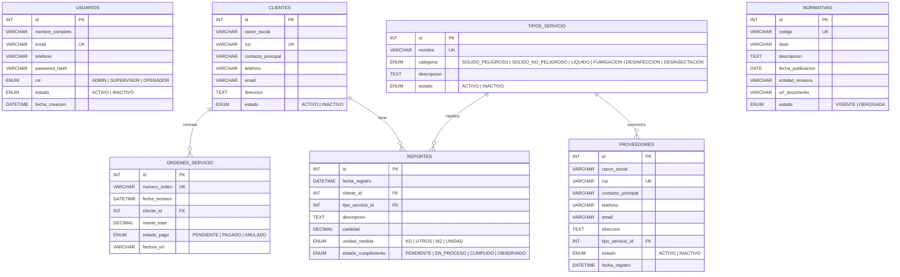
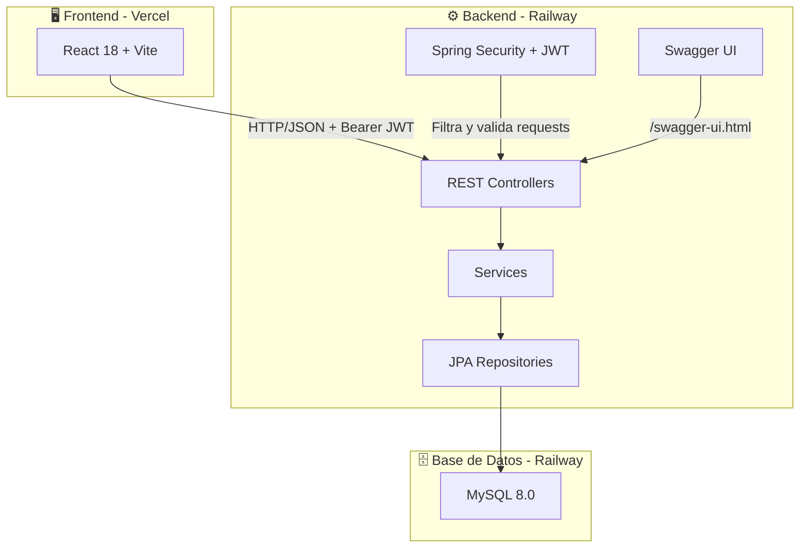

# 🌿 Econexus Backend

**Sistema de Gestión de Reportes y Normativas de Saneamiento Ambiental**

Backend RESTful desarrollado con Spring Boot + Java 17 para administrar, monitorear y optimizar los procesos de una empresa enfocada en servicios de saneamiento ambiental (Fumigación, Desinsectación, Manejo de Residuos Sólidos y Líquidos).

> 🔗 **Frontend:** [Econexus Frontend (React + Vite)](https://github.com/Alessandro-BS/Econexus_Frontend) — Desplegado en [econexus-frontend.vercel.app](https://econexus-frontend.vercel.app)

---

## ⚙️ Stack Tecnológico

| Componente | Tecnología | Versión |
|---|---|---|
| Lenguaje | Java | 17 LTS |
| Framework | Spring Boot | 3.2.5 |
| Build Tool | Maven | 3.9+ |
| Base de Datos | MySQL | 8.0 |
| Documentación API | SpringDoc OpenAPI (Swagger) | 2.3.0 |
| Seguridad | Spring Security + JWT (jjwt) | 0.12.5 |
| Deploy | Railway | — |

### Dependencias principales

- **Spring Web** — REST APIs
- **Spring Data JPA** — Persistencia con Hibernate
- **Spring Boot Validation** — Validación de DTOs (`@Valid`, `@NotBlank`, etc.)
- **MySQL Connector/J** — Driver de base de datos
- **Lombok** — Reducción de boilerplate (`@Data`, `@Builder`, etc.)
- **Spring Boot DevTools** — Hot reload en desarrollo
- **SpringDoc OpenAPI** — Swagger UI interactivo
- **Spring Security + JWT** — Autenticación y autorización por roles

---

## 📂 Estructura del Proyecto

```
Econexus-Backend/
├── .mvn/wrapper/              # Maven Wrapper
├── src/
│   ├── main/
│   │   ├── java/com/econexus/backend/
│   │   │   ├── config/        # Configuración (CORS, Swagger, Security)
│   │   │   ├── security/      # JWT Token Provider, Auth Filter
│   │   │   ├── model/         # Entidades JPA (7 tablas)
│   │   │   ├── repository/    # Interfaces JPA Repository
│   │   │   ├── dto/
│   │   │   │   ├── request/   # DTOs de entrada (validados)
│   │   │   │   └── response/  # DTOs de salida (sin datos sensibles)
│   │   │   ├── service/       # Lógica de negocio
│   │   │   ├── controller/    # REST Controllers (documentados con Swagger)
│   │   │   ├── exception/     # Manejo global de excepciones
│   │   │   └── EconexusBackendApplication.java
│   │   └── resources/
│   │       └── application.yml
│   └── test/java/com/econexus/backend/
├── .gitignore
├── .gitattributes
├── mvnw / mvnw.cmd            # Maven Wrapper scripts
├── pom.xml                    # Configuración Maven + dependencias
└── README.md
```

---

## 🗄️ Diagrama de Base de Datos



---

## 🏗️ Diagrama de Arquitectura



---

## ✅ Requerimientos Funcionales

| ID | Módulo | Descripción |
|---|---|---|
| RF-01 | Autenticación | Login con email/password, generación de JWT |
| RF-02 | Autenticación | Control de acceso por roles (ADMIN, SUPERVISOR, OPERADOR) |
| RF-03 | Usuarios | CRUD completo de usuarios del sistema |
| RF-04 | Clientes | Crear, listar, editar y eliminar clientes (empresas contratantes) |
| RF-05 | Proveedores | CRUD de proveedores con relación a tipo de servicio |
| RF-06 | Tipos de Servicio | Catálogo de tipos de servicio/residuo |
| RF-07 | Órdenes de Servicio | Gestión de órdenes vinculadas a clientes con estados de pago |
| RF-08 | Reportes | Registro de cumplimiento post-servicio con estados |
| RF-09 | Normativas | Registro de marco legal aplicable (independiente) |
| RF-10 | Dashboard | Endpoint de KPIs: montos cobrados, órdenes generadas/pendientes, total clientes |
| RF-11 | Búsqueda | Endpoint de búsqueda global multi-módulo |
| RF-12 | Validación | Validación de datos de entrada en todos los endpoints |

## 🔒 Requerimientos No Funcionales

| ID | Categoría | Descripción |
|---|---|---|
| RNF-01 | Rendimiento | Tiempo de respuesta < 500ms para operaciones CRUD |
| RNF-02 | Seguridad | Passwords hasheados con BCrypt, tokens JWT con expiración de 24h |
| RNF-03 | Seguridad | CORS configurado exclusivamente para el dominio del frontend |
| RNF-04 | Disponibilidad | Deploy en Railway con uptime ≥ 99% |
| RNF-05 | Escalabilidad | Arquitectura en capas (Controller → Service → Repository) |
| RNF-06 | Mantenibilidad | Patrón DTO para desacoplar entidades de respuestas API |
| RNF-07 | Documentación | API documentada con Swagger/OpenAPI accesible en `/swagger-ui.html` |
| RNF-08 | Compatibilidad | API RESTful consumible desde React (JSON) |
| RNF-09 | Código | Convenciones Java estándar, código documentado con Javadoc |

---

## 🔐 Roles y Permisos (RBAC)

| Acción | ADMIN | SUPERVISOR | OPERADOR |
|---|---|---|---|
| Gestionar usuarios | ✅ | ❌ | ❌ |
| Crear/Editar/Eliminar clientes | ✅ | ❌ | ❌ |
| Crear/Editar órdenes | ✅ | ✅ | ❌ |
| Editar reportes | ✅ | ✅ | ❌ |
| Crear reportes | ✅ | ✅ | ✅ |
| Listar/Ver datos | ✅ | ✅ | ✅ |

---

## 🌐 Endpoints REST

| Método | Endpoint | Descripción | Rol mínimo |
|---|---|---|---|
| `POST` | `/api/auth/login` | Login | Público |
| `GET` | `/api/clientes` | Listar clientes | OPERADOR |
| `GET` | `/api/clientes/buscar?q=` | Buscar cliente por razón social/RUC | OPERADOR |
| `POST` | `/api/clientes` | Crear cliente | ADMIN |
| `PUT` | `/api/clientes/{id}` | Editar cliente | ADMIN |
| `DELETE` | `/api/clientes/{id}` | Eliminar cliente | ADMIN |
| `GET` | `/api/proveedores` | Listar proveedores | OPERADOR |
| `POST` | `/api/proveedores` | Crear proveedor | ADMIN |
| `PUT` | `/api/proveedores/{id}` | Editar proveedor | ADMIN |
| `DELETE` | `/api/proveedores/{id}` | Eliminar proveedor | ADMIN |
| `GET` | `/api/tipos-servicio` | Listar catálogo | OPERADOR |
| `POST` | `/api/tipos-servicio` | Crear tipo | ADMIN |
| `PUT` | `/api/tipos-servicio/{id}` | Editar tipo | ADMIN |
| `DELETE` | `/api/tipos-servicio/{id}` | Eliminar tipo | ADMIN |
| `GET` | `/api/ordenes` | Listar órdenes | OPERADOR |
| `POST` | `/api/ordenes` | Crear orden | SUPERVISOR |
| `PUT` | `/api/ordenes/{id}` | Editar orden | SUPERVISOR |
| `DELETE` | `/api/ordenes/{id}` | Anular orden | ADMIN |
| `GET` | `/api/reportes` | Listar reportes | OPERADOR |
| `POST` | `/api/reportes` | Crear reporte | OPERADOR |
| `PUT` | `/api/reportes/{id}` | Editar reporte | SUPERVISOR |
| `DELETE` | `/api/reportes/{id}` | Eliminar reporte | ADMIN |
| `GET` | `/api/normativas` | Listar normativas | OPERADOR |
| `POST` | `/api/normativas` | Crear normativa | ADMIN |
| `PUT` | `/api/normativas/{id}` | Editar normativa | ADMIN |
| `DELETE` | `/api/normativas/{id}` | Eliminar normativa | ADMIN |
| `GET` | `/api/usuarios` | Listar usuarios | ADMIN |
| `POST` | `/api/usuarios` | Crear usuario | ADMIN |
| `PUT` | `/api/usuarios/{id}` | Editar usuario | ADMIN |
| `PATCH` | `/api/usuarios/{id}/estado` | Activar/Desactivar | ADMIN |
| `GET` | `/api/dashboard/kpis` | KPIs globales | SUPERVISOR |
| `GET` | `/api/busqueda?q=` | Búsqueda global | OPERADOR |

---

## 🗓️ Plan de Sprints (4 Semanas)

### Sprint 1 — Fundamentos y Backlog (May 8–14) `30 SP`

| HU | Historia | SP |
|---|---|---|
| HU-CF01 | Inicializar proyecto Spring Boot con Maven | 3 |
| HU-CF02 | Configurar conexión a MySQL con JPA | 3 |
| HU-CF03 | Configurar Swagger/OpenAPI | 2 |
| HU-CF04 | Configurar CORS | 1 |
| HU-CF05 | Implementar manejador global de excepciones | 3 |
| HU-CF06 | Definir estructura de paquetes | 2 |
| HU-CF07 | Crear DTOs base (Request/Response) | 3 |
| HU-C01 | Listar clientes | 3 |
| HU-C02 | Crear cliente | 3 |
| HU-TS01 | Listar tipos de servicio | 2 |
| HU-TS02 | Crear tipo de servicio | 2 |
| HU-N01 | Listar normativas | 2 |
| HU-N02 | Crear normativa | 3 |

### Sprint 2 — CRUDs Completos (May 15–21) `38 SP`

| HU | Historia | SP |
|---|---|---|
| HU-C03 | Editar cliente | 3 |
| HU-C04 | Eliminar cliente | 2 |
| HU-C05 | Buscar clientes por razón social/RUC | 3 |
| HU-P01 | Listar proveedores | 3 |
| HU-P02 | Crear proveedor | 3 |
| HU-P03 | Editar proveedor | 3 |
| HU-P04 | Eliminar proveedor | 2 |
| HU-TS03 | Editar tipo de servicio | 2 |
| HU-TS04 | Eliminar tipo de servicio | 1 |
| HU-O01 | Listar órdenes de servicio | 3 |
| HU-O02 | Buscar cliente al crear orden | 5 |
| HU-O03 | Crear orden de servicio | 5 |
| HU-N03 | Editar normativa | 2 |
| HU-N04 | Eliminar normativa | 1 |

### Sprint 3 — Reportes + Usuarios + Login (May 22–28) `39 SP`

| HU | Historia | SP |
|---|---|---|
| HU-O04 | Editar orden | 3 |
| HU-O05 | Eliminar/anular orden | 2 |
| HU-R01 | Listar reportes | 3 |
| HU-R02 | Crear reporte | 5 |
| HU-R03 | Editar reporte | 3 |
| HU-R04 | Eliminar reporte | 2 |
| HU-U01 | Listar usuarios | 3 |
| HU-U02 | Crear usuario (con BCrypt) | 5 |
| HU-U03 | Editar usuario | 3 |
| HU-U04 | Desactivar usuario | 2 |
| HU-A01 | Login con JWT | 8 |

### Sprint 4 — Seguridad + Dashboard + Deploy (May 29–Jun 4) `23 SP`

| HU | Historia | SP |
|---|---|---|
| HU-A02 | Validar tokens JWT en cada request | 8 |
| HU-A03 | Proteger endpoints por rol | 5 |
| HU-D01 | KPIs del dashboard | 5 |
| HU-D02 | Estadísticas de órdenes | 5 |

> **Total: 130 Story Points** en 4 sprints

> 🔗 **Scrum (Jira):** https://proyecto-econexus.atlassian.net/jira/software/projects/SCRU/summary

---

## 🛠️ Instalación y Uso

### Prerrequisitos

- Java 17+
- MySQL 8.0 (local o en Railway)

### 1. Clonar el repositorio

```bash
git clone https://github.com/Alessandro-BS/Econexus-Backend.git
cd Econexus-Backend
```

### 2. Configurar la base de datos

Crear la base de datos ejecutando el script SQL:
```sql
CREATE DATABASE IF NOT EXISTS saneamiento_ambiental
  DEFAULT CHARACTER SET utf8mb4
  DEFAULT COLLATE utf8mb4_unicode_ci;
```

### 3. Configurar variables de entorno (opcional)

Si usas valores distintos a los defaults, configura:
```bash
export DB_HOST=localhost
export DB_PORT=3306
export DB_NAME=saneamiento_ambiental
export DB_USER=root
export DB_PASSWORD=root
```

### 4. Ejecutar el servidor

```bash
# Windows
.\mvnw.cmd spring-boot:run

# Linux / Mac
./mvnw spring-boot:run
```

El servidor estará disponible en `http://localhost:8080`

### 5. Acceder a Swagger UI

```
http://localhost:8080/swagger-ui.html
```

---

## 👥 Equipo

Proyecto desarrollado para el curso de **Herramientas de Desarrollo**.