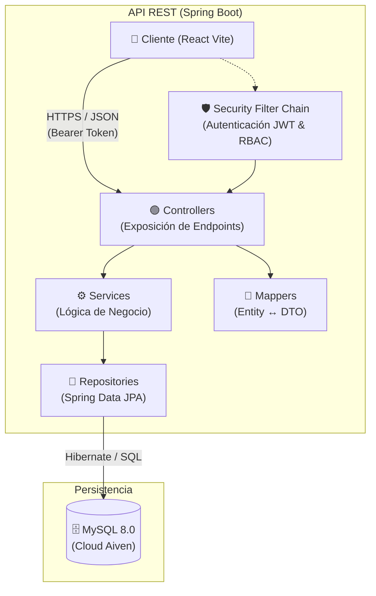
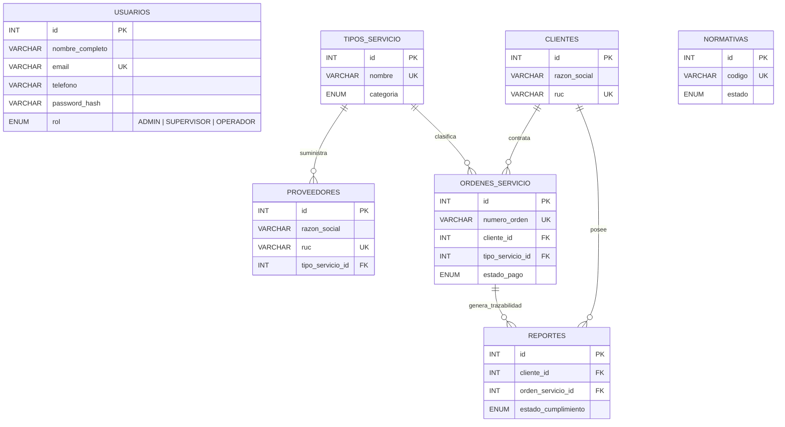

# 🌿 Econexus Backend - API RESTful


**Sistema de Gestión de Reportes y Normativas de Saneamiento Ambiental**

Backend RESTful corporativo desarrollado bajo arquitectura multicapa para administrar, monitorear y optimizar los procesos de una empresa enfocada en servicios de saneamiento ambiental (Fumigación, Desinsectación, Manejo de Residuos Sólidos y Líquidos).

> 🔗 **Frontend (React):** [Repositorio](https://github.com/Alessandro-BS/Econexus_Frontend) | [Live Demo](https://econexus-frontend.onrender.com/)
> 🔗 **Backend (API):** [Live API](https://econexus-backend-0aa6.onrender.com) | [Swagger UI Docs](https://econexus-backend-0aa6.onrender.com/swagger-ui.html)

---

## ⚙️ Stack Tecnológico y Dependencias

El proyecto está construido sobre el ecosistema de Spring, priorizando seguridad, validación y fácil mantenimiento mediante el patrón DTO.

- **Core & API:** Java 17 LTS, Spring Boot 3.2.5, Spring Web
- **Persistencia:** Spring Data JPA, Hibernate, MySQL Connector/J
- **Seguridad:** Spring Security, JSON Web Tokens (JJWT 0.12.5)
- **Documentación:** SpringDoc OpenAPI 2.3.0 (Swagger)
- **Utilidades:** Lombok (Reducción de boilerplate), Spring Boot Validation (Jakarta)
- **Despliegue & CI/CD:** Render, GitHub Actions

---

## 🏗️ Arquitectura del Sistema

El sistema implementa una arquitectura limpia (Clean Architecture) dividida en capas físicas y lógicas, asegurando el principio de responsabilidad única (SRP).


```mermaid
graph TD
    Client["📱 Cliente (React Vite)"] -- "HTTPS / JSON\n(Bearer Token)" --> Controller
    
    subgraph "API REST (Spring Boot)"
        Controller["🟢 Controllers\n(Exposición de Endpoints)"] 
        Security["🛡️ Security Filter Chain\n(Autenticación JWT & RBAC)"]
        Service["⚙️ Services\n(Lógica de Negocio)"]
        Mapper["🔄 Mappers\n(Entity ↔ DTO)"]
        Repository["💾 Repositories\n(Spring Data JPA)"]
        
        Client -.-> Security
        Security --> Controller
        Controller --> Mapper
        Controller --> Service
        Service --> Repository
    end
    
    subgraph "Persistencia"
        Database[("🗄️ MySQL 8.0\n(Cloud Aiven)")]
    end
    
    Repository -- "Hibernate / SQL" --> Database
```

---

## 🗄️ Modelo Entidad-Relación (MER)

La base de datos relacional está completamente normalizada para garantizar la integridad referencial de los servicios medioambientales.


```mermaid
erDiagram
    USUARIOS {
        INT id PK
        VARCHAR nombre_completo
        VARCHAR email UK
        VARCHAR telefono
        VARCHAR password_hash
        ENUM rol "ADMIN | SUPERVISOR | OPERADOR"
    }

    CLIENTES {
        INT id PK
        VARCHAR razon_social
        VARCHAR ruc UK
    }

    TIPOS_SERVICIO {
        INT id PK
        VARCHAR nombre UK
        ENUM categoria
    }

    PROVEEDORES {
        INT id PK
        VARCHAR razon_social
        VARCHAR ruc UK
        INT tipo_servicio_id FK
    }

    ORDENES_SERVICIO {
        INT id PK
        VARCHAR numero_orden UK
        INT cliente_id FK
        INT tipo_servicio_id FK
        ENUM estado_pago
    }

    REPORTES {
        INT id PK
        INT cliente_id FK
        INT orden_servicio_id FK
        ENUM estado_cumplimiento
    }

    NORMATIVAS {
        INT id PK
        VARCHAR codigo UK
        ENUM estado
    }

    CLIENTES ||--o{ ORDENES_SERVICIO : "contrata"
    CLIENTES ||--o{ REPORTES : "posee"
    TIPOS_SERVICIO ||--o{ PROVEEDORES : "suministra"
    TIPOS_SERVICIO ||--o{ ORDENES_SERVICIO : "clasifica"
    ORDENES_SERVICIO ||--o{ REPORTES : "genera_trazabilidad"
```

---

## 🔐 Seguridad y Autenticación (RBAC)

El acceso a los recursos de la API está protegido mediante **JSON Web Tokens (JWT)** y control de acceso basado en roles (RBAC). Todo request (excepto `/api/auth/login`) requiere un header `Authorization: Bearer <token>`.

| Módulo / Acción | `ROLE_ADMIN` | `ROLE_SUPERVISOR` | `ROLE_OPERADOR` |
|:---|:---:|:---:|:---:|
| **Usuarios** (Crear, Editar, Eliminar) | ✅ | ❌ | ❌ |
| **Clientes & Proveedores** (Mutaciones) | ✅ | ❌ | ❌ |
| **Órdenes de Servicio** (Crear, Editar) | ✅ | ✅ | ❌ |
| **Reportes** (Crear) | ✅ | ✅ | ✅ |
| **Lectura global** (GET endpoints) | ✅ | ✅ | ✅ |

---

## 🚀 Endpoints Principales y Documentación

La documentación interactiva completa de todos los endpoints, esquemas de DTOs y parámetros está autogenerada con Swagger. 
👉 **[Ver Documentación Swagger de la API](https://econexus-backend-0aa6.onrender.com/swagger-ui.html)**

### Autenticación
- `POST /api/auth/login` - Genera token JWT.

### Recursos (Ejemplo)
- `GET /api/clientes` - Lista de clientes paginada.
- `POST /api/ordenes` - Creación de nueva orden de servicio.
- `GET /api/dashboard/kpis` - Estadísticas y métricas del negocio.

---

## 🛠️ Instalación y Entorno de Desarrollo

### Prerrequisitos
- **Java Development Kit (JDK) 17** o superior.
- **MySQL 8.0** instalado localmente o en un contenedor Docker.
- **Git** y **Maven** (Opcional, se incluye Maven Wrapper).

### 1. Clonar el repositorio
```bash
git clone https://github.com/Alessandro-BS/Econexus-Backend.git
cd Econexus-Backend
```

### 2. Configurar la Base de Datos
Ejecuta el siguiente comando en tu cliente MySQL para crear la base de datos:
```sql
CREATE DATABASE IF NOT EXISTS saneamiento_ambiental
  DEFAULT CHARACTER SET utf8mb4
  DEFAULT COLLATE utf8mb4_unicode_ci;
```

### 3. Variables de Entorno
Crea un archivo `application-dev.yml` o configura las variables de entorno en tu sistema:
```properties
SPRING_DATASOURCE_URL=jdbc:mysql://localhost:3306/saneamiento_ambiental
SPRING_DATASOURCE_USERNAME=root
SPRING_DATASOURCE_PASSWORD=tu_password
JWT_SECRET_KEY=tu_clave_secreta_en_base64_muy_larga
```

### 4. Compilar y Ejecutar
Usando Maven Wrapper (no requiere instalación previa de Maven):

**En Windows:**
```cmd
.\mvnw.cmd clean install -DskipTests
.\mvnw.cmd spring-boot:run
```

**En Linux / macOS:**
```bash
./mvnw clean install -DskipTests
./mvnw spring-boot:run
```

El servidor iniciará en `http://localhost:8080`.
La documentación Swagger estará en `http://localhost:8080/swagger-ui.html`.

---

## 👨‍💻 Contribución y Sprints

El desarrollo de este backend se gestionó utilizando la metodología ágil **Scrum** en 4 Sprints principales, alcanzando 130 Story Points en total.

1. **Sprint 1:** Configuración inicial, DTOs, Seguridad Base y CRUDs menores.
2. **Sprint 2:** Lógica de negocio relacional, Órdenes de Servicio y Proveedores.
3. **Sprint 3:** Reportes técnicos, Gestión de Usuarios y JWT Auth Filter.
4. **Sprint 4:** Dashboards, KPIs, Validaciones complejas y CI/CD en Render.

*Proyecto desarrollado para el curso de Herramientas de Desarrollo.*