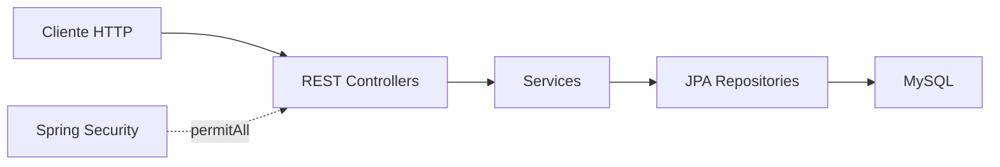

# Analisis tecnico separado - Backend Econexus

Fecha de revision: 2026-05-29
Repositorio: `Econexus-Backend`
Rama objetivo: `develop`

## 1. Resumen ejecutivo

El backend de Econexus esta construido con Spring Boot, Java 17, JPA y MySQL. Tiene una base arquitectonica correcta: controladores REST, servicios, repositorios, DTOs, mappers, entidades, enums, configuraciones y manejo global de excepciones.

El problema principal es la brecha entre lo documentado y lo implementado. El README declara JWT, RBAC, usuarios, dashboard, busqueda global y endpoints completos; el codigo actual implementa parte de los CRUDs, pero la seguridad real no esta activa y varios modulos prometidos no existen.

Veredicto: buena base backend para crecer, pero aun no esta listo como API productiva ni como backend completo del sistema.

## 2. Stack y estructura

| Area | Tecnologia / Evidencia |
|---|---|
| Framework | Spring Boot 3.2.5 |
| Lenguaje | Java 17 |
| Persistencia | Spring Data JPA + Hibernate |
| Base de datos | MySQL |
| Documentacion | SpringDoc OpenAPI / Swagger |
| Seguridad declarada | Spring Security + JWT |
| Seguridad efectiva | `permitAll` en todas las rutas |
| Build | Maven Wrapper presente, pero falla en este entorno |

Estructura revisada:

- `controller/api`: endpoints REST.
- `service` y `service/impl`: logica de negocio.
- `repository`: repositorios JPA.
- `model/entity`: entidades.
- `model/enums`: enums de negocio.
- `dto/request` y `dto/response`: contratos de entrada/salida.
- `mapper`: conversion Entity/DTO.
- `exception`: excepciones y handler global.
- `config`: CORS, Swagger y Security.

## 3. Arquitectura actual



La arquitectura por capas esta bien planteada. La principal deficiencia esta en seguridad, completitud funcional, pruebas y operacion.

## 4. Hallazgos positivos

- Separacion clara de responsabilidades.
- Uso de DTOs para no exponer entidades directamente.
- Uso de `@Valid` en controladores.
- `GlobalExceptionHandler` centraliza errores.
- Uso de `@Transactional` en servicios.
- Repositorios JPA simples y mantenibles.
- Modelo relacional alineado al dominio de saneamiento ambiental.
- Proveedores, ordenes y reportes tienen CRUD o flujo cercano a completo.
- Swagger esta configurado y preparado para bearer auth.

## 5. Hallazgos criticos

### P0 - Seguridad desactivada

`SecurityConfig` contiene:

```java
.anyRequest().permitAll()
```

Impacto: todos los endpoints son publicos. Esto contradice los requerimientos de JWT, roles y permisos.

### P0 - JWT no implementado

El `pom.xml` incluye dependencias `jjwt`, pero no se encontraron:

- `AuthController`;
- `JwtTokenProvider`;
- filtro JWT;
- `CustomUserDetailsService`;
- endpoint `/api/auth/login`;
- validacion de token por request.

Impacto: las historias de autenticacion y seguridad no estan cerradas.

### P0 - Usuarios backend no implementados

El SQL define tabla `usuarios`, pero no existe entidad `Usuario`, repositorio, servicio ni controlador.

Impacto: no hay alta/baja de usuarios real, no hay BCrypt y no hay RBAC persistente.

### P1 - CRUDs incompletos frente al README

| Modulo | Estado real observado |
|---|---|
| Clientes | Listar, crear, buscar. Faltan editar/eliminar |
| Proveedores | CRUD completo con baja logica |
| Tipos de servicio | Listar, crear. Faltan editar/eliminar |
| Ordenes de servicio | Listar, crear, editar, anular |
| Reportes | CRUD completo |
| Normativas | Listar vigentes, crear. Faltan editar/eliminar |
| Usuarios | No implementado |
| Dashboard | No implementado |
| Busqueda global | No implementado |

### P1 - Contratos no alineados con README/frontend

El README documenta `/api/ordenes`, pero el controlador expone `/api/ordenes-servicio`.

Impacto: riesgo de errores de integracion cuando el frontend empiece a consumir la API.

### P1 - Maven Wrapper roto

`./mvnw.cmd test` falla con:

```text
no main manifest attribute ... maven-wrapper.jar
```

Ademas, `mvn` no esta instalado en PATH.

Impacto: no se pudo validar compilacion/pruebas backend desde este entorno.

### P1 - Sin pruebas significativas

Existe estructura `src/test`, pero no se evidencian pruebas utiles para controllers, services o repositorios.

Impacto: cada cambio de API o persistencia tiene riesgo alto de regresion.

### P2 - Configuracion de desarrollo en application.yml

Se observo:

- `ddl-auto: update`
- `show-sql: true`
- secreto JWT por defecto

Impacto: aceptable para desarrollo, riesgoso si se despliega sin perfiles productivos.

### P2 - Generacion de numero de orden vulnerable a concurrencia

La orden se genera leyendo maximo consecutivo y sumando uno en memoria. Dos requests simultaneas podrian producir el mismo numero.

Impacto: error intermitente por unique constraint.

## 6. Analisis por capa

### Controllers

Son simples y legibles. Falta aplicar seguridad declarativa por rol y completar endpoints pendientes. Se recomienda versionar API con `/api/v1`.

### Services

La logica esta bien ubicada. Hay validaciones importantes, como duplicados en proveedores/tipos/normativas. Falta homogenizar validaciones en clientes y fortalecer reglas de negocio transversales.

### Repositories

Correctos para el alcance actual. A futuro conviene agregar consultas agregadas para dashboard y busqueda global.

### DTOs y mappers

Buen patron de desacoplamiento. Se recomienda estandarizar naming: evitar mezclar snake_case en DTO Java si el contrato JSON puede resolverse con `@JsonProperty`.

### Entidades y base de datos

El modelo SQL tiene sentido. Falta incorporar `Usuario` al modelo Java y migraciones versionadas.

### Excepciones

El handler central es positivo. Debe evitar exponer mensajes internos en 500:

```text
Error interno del servidor: <detalle tecnico>
```

## 7. Trazabilidad backend vs backlog

| Historia / Area | Estado inferido |
|---|---|
| Configuracion Spring Boot/JPA/Swagger/CORS | Parcial a completa |
| Clientes listar/crear/buscar | Parcialmente completo |
| Clientes editar/eliminar | Pendiente |
| Proveedores CRUD | Parcialmente completo |
| Tipos servicio CRUD completo | Parcial |
| Ordenes servicio | Parcialmente completo |
| Reportes CRUD | Parcialmente completo |
| Normativas CRUD completo | Parcial |
| Usuarios CRUD | Pendiente |
| Login JWT | Pendiente |
| Validacion JWT | Pendiente |
| Proteccion por roles | Pendiente |
| Dashboard KPIs | Pendiente |
| Busqueda global | Pendiente |

## 8. Riesgos

| Prioridad | Riesgo | Impacto |
|---|---|---|
| P0 | API sin autenticacion | Exposicion total de datos y operaciones |
| P0 | Usuarios/JWT inexistentes | No se cumple seguridad documentada |
| P1 | CRUDs incompletos | Frontend no podra integrarse completamente |
| P1 | Wrapper Maven roto | No hay verificacion confiable de build |
| P1 | Sin tests | Regresiones probables |
| P2 | `ddl-auto:update` | Cambios de esquema sin control |
| P2 | Consecutivo de orden en memoria | Colisiones bajo concurrencia |

## 9. Recomendaciones

### Corto plazo

- Reparar Maven Wrapper.
- Agregar entidad `Usuario` y repositorio.
- Implementar BCrypt.
- Implementar login JWT.
- Reemplazar `permitAll` por reglas reales.
- Completar endpoints faltantes de clientes, tipos y normativas.

### Mediano plazo

- Implementar dashboard backend.
- Implementar busqueda global.
- Alinear rutas con README/frontend.
- Agregar tests unitarios de services.
- Agregar `@WebMvcTest` para controllers.
- Agregar migraciones Flyway o Liquibase.

### Largo plazo

- Versionar API con `/api/v1`.
- Separar perfiles `dev`, `test`, `prod`.
- Agregar Testcontainers o perfil H2 para integracion.
- Agregar CI/CD con `test`, `package` y analisis estatico.
- Incorporar auditoria basica para operaciones sensibles.

## 10. Roadmap sugerido

| Semana | Objetivo | Resultado esperado |
|---|---|---|
| 1 | Build y seguridad base | Maven Wrapper reparado, Usuario, BCrypt, login |
| 2 | JWT/RBAC | Filtro JWT, roles por endpoint, Swagger protegido |
| 3 | CRUDs faltantes | Clientes, tipos y normativas completos |
| 4 | Integracion funcional | Dashboard, busqueda global, contratos estables |
| 5 | Calidad productiva | Tests, migraciones, perfiles y CI |

## 11. Criterios para considerar listo el backend

- `mvn test` o `./mvnw test` ejecuta correctamente.
- No existe `permitAll` global.
- Login JWT implementado y probado.
- Passwords hasheados con BCrypt.
- Endpoints protegidos por rol.
- CRUDs documentados en README existen realmente.
- Dashboard y busqueda global implementados si siguen en alcance.
- `application-prod.yml` no usa `ddl-auto:update` ni `show-sql:true`.
- Swagger refleja el contrato real.
- Hay pruebas para servicios y controladores principales.

## 12. Conclusion

El backend de Econexus tiene una estructura profesional para una API REST por capas, pero necesita cerrar seguridad, usuarios, pruebas y completitud funcional. La prioridad debe ser convertir la base actual en una API confiable, protegida y consumible por el frontend, antes de expandir nuevas funcionalidades.
